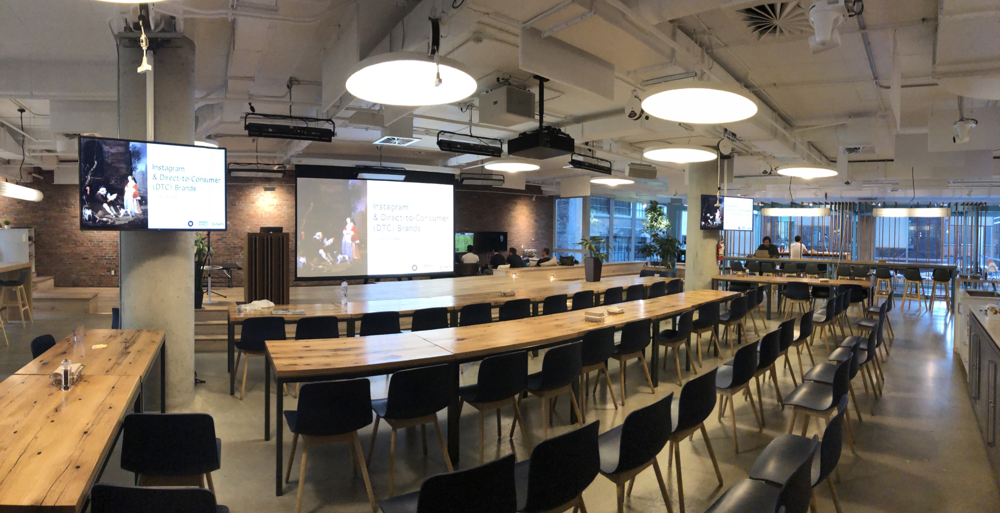
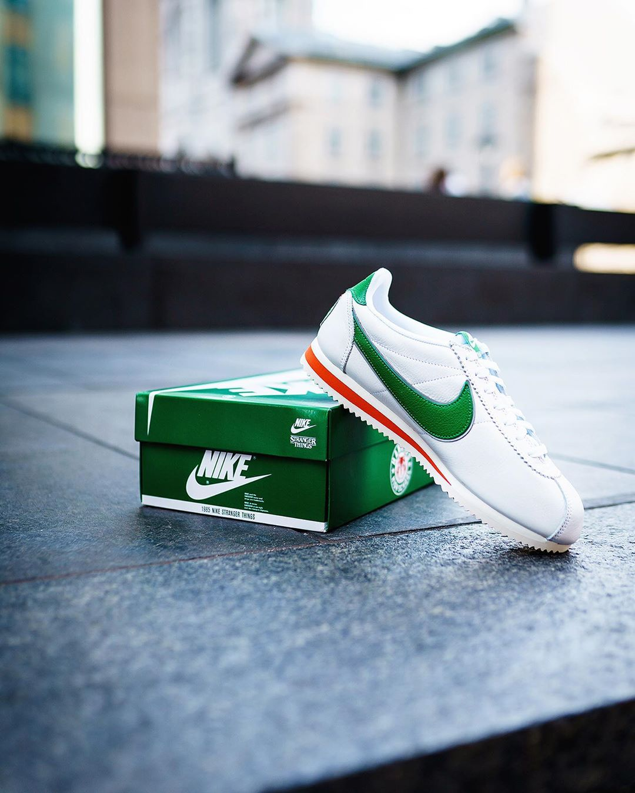

## Comment Instagram a impacté la relation entre la photographie et le commerce? Venez écouter 2 experts sur le sujet suivi par un temps d'échange

Nous avons entendu beaucoup de questions autour d'Instagram. Nous avions également envie d'organiser un événement plus éducationnel. Enfin, nous voulions démarrer un projet avec nos amis chez [Burst](https://burst.shopify.com).

> Burst is a free stock photo platform that is powered by Shopify [...] constantly uploading new photos and adding new categories to reflect current trends in ecommerce and retail.

Nous étions honorés d'avoir le support de Burst et Shopify Montréal pour cet événement. Et encore plus d'avoir deux conférenciers incroyables ce soir là.

### Instagram & Direct-To-Consumer Companies par Ali Inay

Ali est un photographe et fondateur de [#mtlcafecrawl](https://www.instagram.com/mtlcafecrawl/). Il a partagé son expérience et ses analyses sur les marques DTC et comment elles mettent à profit leur présence sur Instagram.

### Instagram is part of the journey, not the destination by Vineeth Sampathkumar

Vineeth est un Growth Manager à Shopify et un photographe spécialisé en chaussures.Il a partagé ses tactiques de croissance et sa stratégie de marque, et comment les appliquer à la croissance d'un compte Instagram.

_L'introduction et la clôture and closing remarks furent présentées par Jp Valery, fondateur du Montréal Photo Club et Katie Bowes, Operations Manager à Burst._

Assurez-vous de ne pas manquer le prochain événément, inscrivez vous gratuitement 👇
